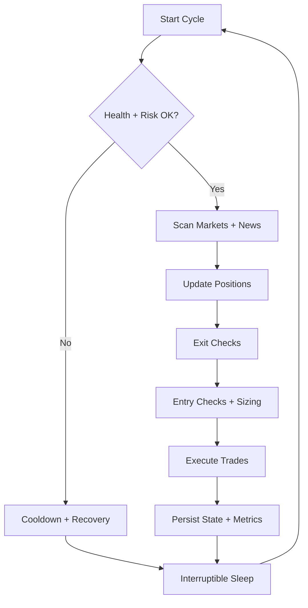

# 24/7 Polymarket Trading Bot Workflow Architecture (Lite)

This is a concise operational view of the 24/7 loop. For the full reference architecture, see `docs/TRADING_WORKFLOW_ARCHITECTURE.md`.

## Core Loop (High Level)

## Timing Defaults

- Base interval: 15 minutes
- Fast interval: 5 minutes when active
- Cooldown interval: 5 minutes after risk block
- Health check: 60 seconds
- Heartbeat: 30 seconds

## Risk Gates (Pre-Trade)

- Max drawdown and max daily loss
- Max position size and max open positions
- Edge/confidence thresholds
- Liquidity and volume minimums

## Error Recovery (Condensed)

- Retry transient network/API errors with exponential backoff
- Skip markets on data validation errors
- Pause trading on risk breaches or auth failures, alert operator

## Monitoring & Alerts

- Log cycle summary, trades, and errors
- Emit equity, drawdown, win rate, and exposure metrics
- Alert on repeated failures or risk violations

## Self-Healing

- Reconnect APIs and reload state
- Reduce scan cadence under repeated failures
- Auto-resume when health checks pass
