# Polymarket Bot: 24/7 Trading Workflow Architecture (Full)

## Executive Summary

This document outlines a comprehensive 24/7 automated trading workflow architecture for the Polymarket trading bot. The system is designed for resilience, self-healing, and continuous operation with minimal human intervention.

---

## Table of Contents

1. [System Overview](#1-system-overview)
2. [Main Trading Loop Architecture](#2-main-trading-loop-architecture)
3. [Error Recovery Framework](#3-error-recovery-framework)
4. [Risk Management Workflow](#4-risk-management-workflow)
5. [Monitoring & Alerting System](#5-monitoring--alerting-system)
6. [Self-Healing Mechanisms](#6-self-healing-mechanisms)
7. [State Machine Specifications](#7-state-machine-specifications)
8. [Decision Trees](#8-decision-trees)
9. [Implementation Roadmap](#9-implementation-roadmap)

## Status

This is a full reference architecture document. Some subsystems are planned but not implemented in the current codebase.

---

## 1. System Overview

### High-Level Architecture Diagram

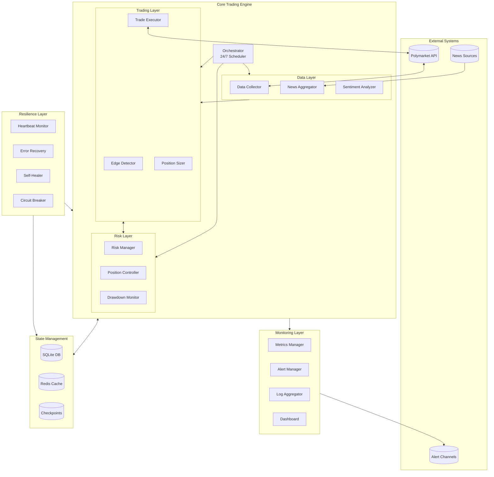

### Component Responsibilities

| Component | Responsibility | Criticality |
|-----------|---------------|-------------|
| Orchestrator | Main loop timing, task scheduling | Critical |
| Data Collector | Market data fetching, caching | High |
| Edge Detector | Opportunity identification | High |
| Risk Manager | Portfolio protection | Critical |
| Self-Healer | Automatic recovery | Critical |
| Circuit Breaker | Failure isolation | Critical |

---

## 2. Main Trading Loop Architecture

### 2.1 Primary Trading Cycle

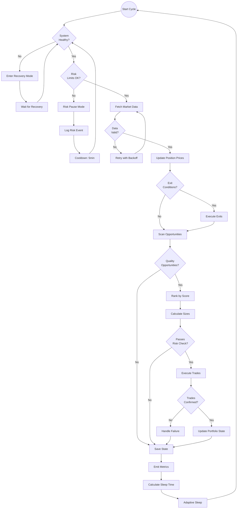

### 2.2 Timing Configuration

```mermaid
gantt
    title Trading Cycle Timing (15-minute base interval)
    dateFormat X
    axisFormat %S
    
    section Data Collection
    Fetch Markets       :0, 10
    Fetch News          :10, 20
    Analyze Sentiment   :20, 40
    
    section Analysis
    Update Positions    :40, 50
    Check Exits         :50, 60
    Scan Opportunities  :60, 90
    
    section Execution
    Risk Validation     :90, 100
    Execute Trades      :100, 120
    Confirm Orders      :120, 140
    
    section State
    Save Checkpoint     :140, 150
    Emit Metrics        :150, 160
    
    section Sleep
    Adaptive Sleep      :160, 900
```

### 2.3 Adaptive Timing Logic

```python
# Timing Configuration
TIMING_CONFIG = {
    "base_interval_seconds": 900,        # 15 minutes normal
    "fast_interval_seconds": 300,        # 5 minutes when active
    "urgent_interval_seconds": 60,       # 1 minute on breaking news
    "slow_interval_seconds": 1800,       # 30 minutes low activity
    
    "max_execution_time_seconds": 120,   # Max time for cycle
    "health_check_interval": 60,         # Health check every minute
    "heartbeat_interval": 30,            # Heartbeat every 30s
    
    "market_hours": {
        "active": {"start": 8, "end": 22},    # UTC
        "reduced": {"start": 22, "end": 8},
    },
    
    "volatility_multipliers": {
        "low": 2.0,      # Double interval
        "normal": 1.0,   # Standard
        "high": 0.5,     # Half interval
        "extreme": 0.25, # Quarter interval
    }
}
```

---

## 3. Error Recovery Framework

### 3.1 Error Classification Hierarchy

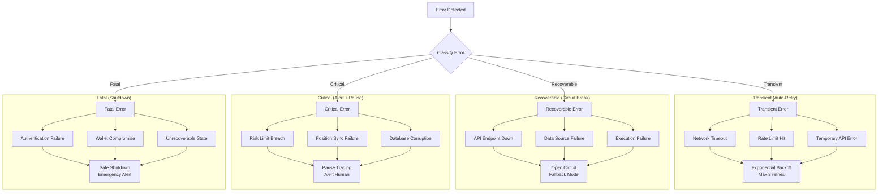

### 3.2 Circuit Breaker State Machine

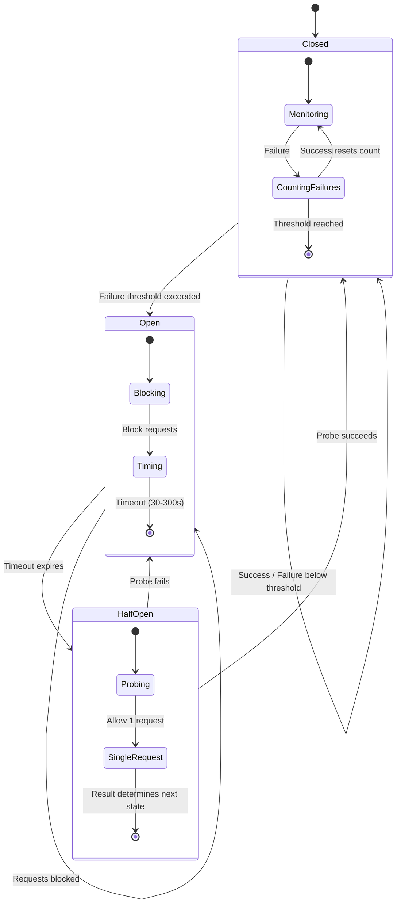

### 3.3 Recovery Workflow

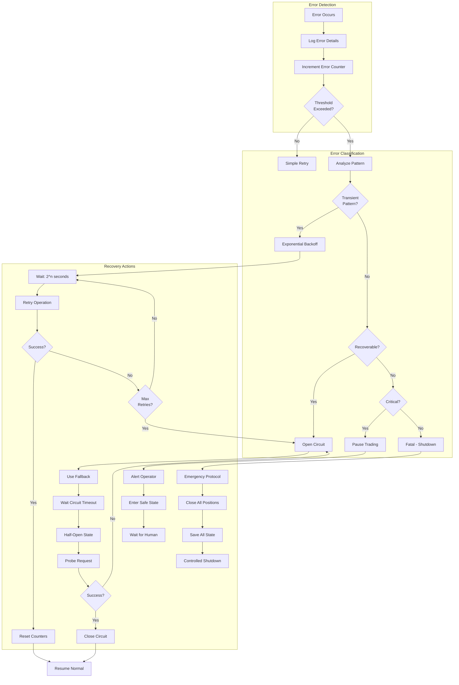

### 3.4 Error Recovery Configuration

```python
ERROR_RECOVERY_CONFIG = {
    "transient_errors": {
        "max_retries": 3,
        "base_delay_seconds": 1,
        "max_delay_seconds": 60,
        "backoff_multiplier": 2,
        "jitter_range": 0.1,
    },
    
    "circuit_breaker": {
        "failure_threshold": 5,
        "success_threshold": 3,
        "timeout_seconds": 60,
        "max_timeout_seconds": 300,
        "half_open_max_requests": 1,
    },
    
    "critical_errors": {
        "pause_duration_seconds": 300,
        "alert_channels": ["telegram", "email", "sms"],
        "max_auto_recovery_attempts": 3,
        "require_human_ack": True,
    },
    
    "fatal_errors": {
        "emergency_close_positions": True,
        "save_full_state": True,
        "alert_priority": "critical",
        "restart_policy": "manual_only",
    }
}
```

---

## 4. Risk Management Workflow

### 4.1 Multi-Layer Risk Architecture

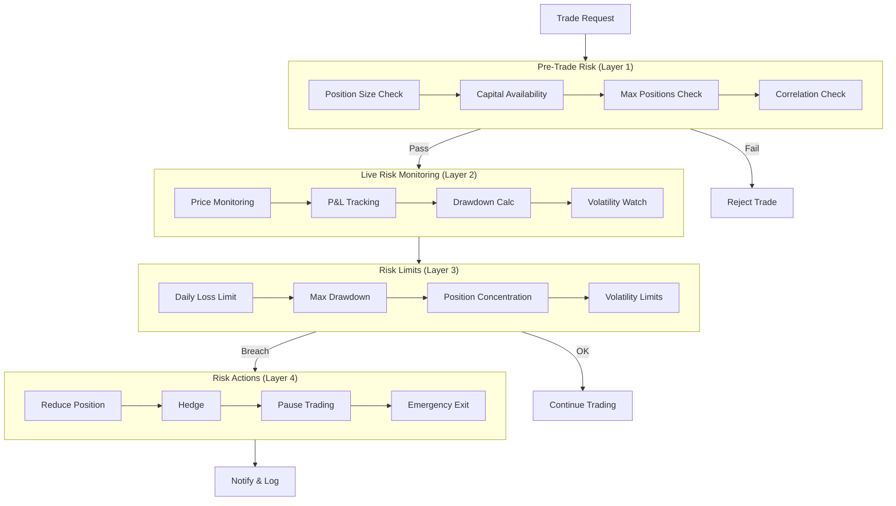

### 4.2 Risk Decision Tree

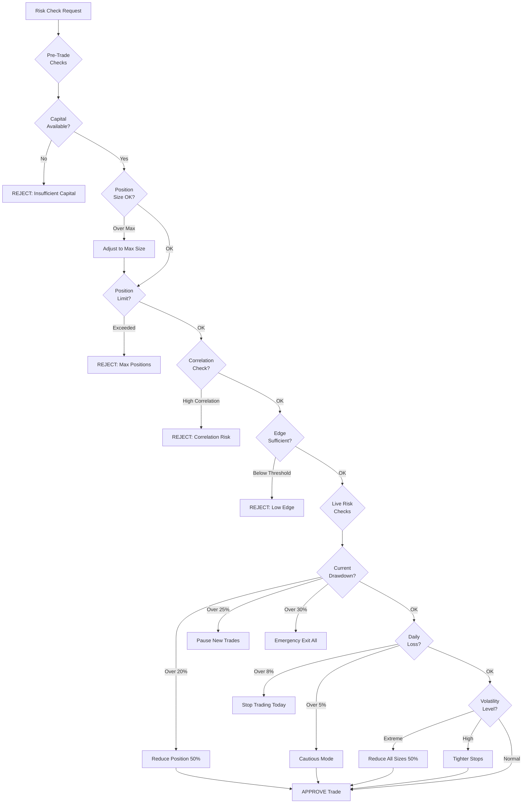

### 4.3 Portfolio Risk State Machine

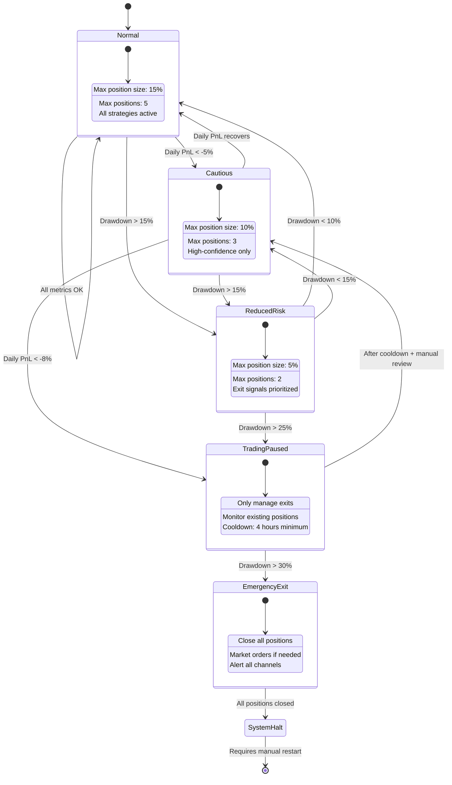

### 4.4 Risk Parameters

```python
RISK_MANAGEMENT_CONFIG = {
    "position_limits": {
        "max_position_pct": 0.15,          # 15% max single position
        "max_positions": 5,                 # Maximum concurrent
        "min_position_size": 1.0,           # Minimum $1
        "max_correlated_exposure": 0.30,    # 30% in correlated markets
    },
    
    "loss_limits": {
        "max_daily_loss_pct": 0.08,         # 8% daily loss
        "max_weekly_loss_pct": 0.15,        # 15% weekly loss
        "max_drawdown_pct": 0.30,           # 30% max drawdown
        "drawdown_reduce_threshold": 0.15,  # Start reducing at 15%
        "drawdown_pause_threshold": 0.25,   # Pause at 25%
    },
    
    "edge_requirements": {
        "min_edge_normal": 0.05,            # 5% minimum edge
        "min_edge_cautious": 0.08,          # 8% in cautious mode
        "min_edge_reduced": 0.12,           # 12% in reduced mode
        "min_confidence": 0.60,             # 60% minimum confidence
    },
    
    "volatility_adjustments": {
        "low_vol_multiplier": 1.2,          # Increase sizes
        "high_vol_multiplier": 0.7,         # Reduce sizes
        "extreme_vol_multiplier": 0.4,      # Significantly reduce
        "extreme_vol_threshold": 3.0,       # 3x normal volatility
    },
    
    "kelly_parameters": {
        "kelly_fraction": 0.25,             # Quarter Kelly
        "max_kelly_fraction": 0.50,         # Never exceed half Kelly
        "confidence_weighting": True,       # Weight by confidence
    }
}
```

---

## 5. Monitoring & Alerting System

### 5.1 Monitoring Architecture

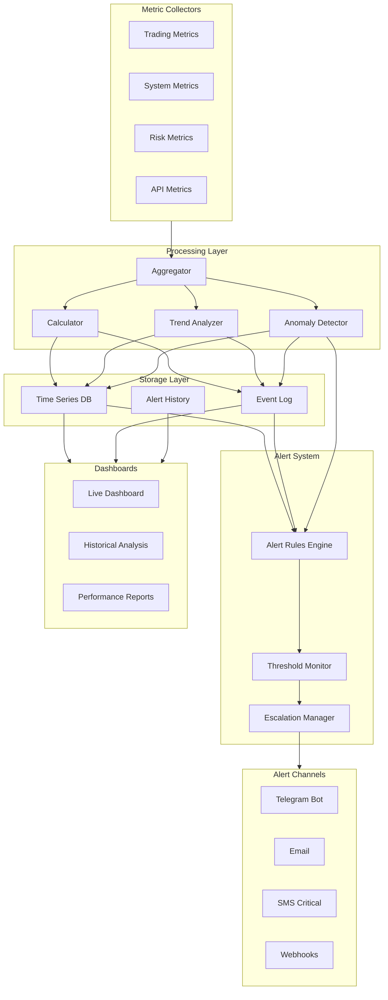

### 5.2 Alert Severity Levels

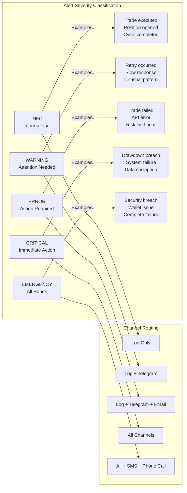

### 5.3 Key Metrics Dashboard

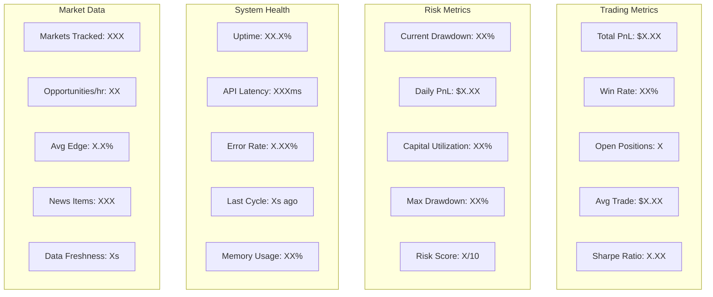

### 5.4 Alert Rules Configuration

```python
ALERT_RULES = {
    "trading_alerts": {
        "trade_executed": {
            "severity": "INFO",
            "channels": ["log", "telegram"],
            "template": "Trade: {direction} ${amount} @ {price} on {market}",
        },
        "trade_failed": {
            "severity": "ERROR",
            "channels": ["log", "telegram", "email"],
            "template": "TRADE FAILED: {error} for {market}",
            "throttle_minutes": 5,
        },
        "position_closed": {
            "severity": "INFO",
            "channels": ["log", "telegram"],
            "template": "Closed: {direction} PnL ${pnl} ({pnl_pct}%)",
        },
    },
    
    "risk_alerts": {
        "drawdown_warning": {
            "condition": "drawdown > 15%",
            "severity": "WARNING",
            "channels": ["log", "telegram", "email"],
            "template": "Drawdown at {drawdown}% - monitoring",
        },
        "drawdown_critical": {
            "condition": "drawdown > 25%",
            "severity": "CRITICAL",
            "channels": ["all"],
            "template": "CRITICAL: Drawdown {drawdown}% - trading paused",
        },
        "daily_loss_limit": {
            "condition": "daily_loss > 8%",
            "severity": "CRITICAL",
            "channels": ["all"],
            "template": "Daily loss limit hit: {loss}%",
        },
    },
    
    "system_alerts": {
        "heartbeat_missed": {
            "condition": "no_heartbeat > 60s",
            "severity": "ERROR",
            "channels": ["log", "telegram", "email"],
            "template": "Heartbeat missed for {duration}s",
        },
        "api_failure": {
            "condition": "api_errors > 5 in 5min",
            "severity": "ERROR",
            "channels": ["log", "telegram", "email"],
            "template": "API failures: {count} in last 5 minutes",
        },
        "system_down": {
            "condition": "no_response > 300s",
            "severity": "EMERGENCY",
            "channels": ["all", "sms"],
            "template": "EMERGENCY: System unresponsive for {duration}s",
        },
    },
    
    "performance_alerts": {
        "exceptional_win": {
            "condition": "trade_pnl > 30%",
            "severity": "INFO",
            "channels": ["log", "telegram"],
            "template": "Big win! +{pnl}% on {market}",
        },
        "losing_streak": {
            "condition": "consecutive_losses > 5",
            "severity": "WARNING",
            "channels": ["log", "telegram"],
            "template": "Losing streak: {count} consecutive losses",
        },
    }
}
```

---

## 6. Self-Healing Mechanisms

### 6.1 Self-Healing Architecture

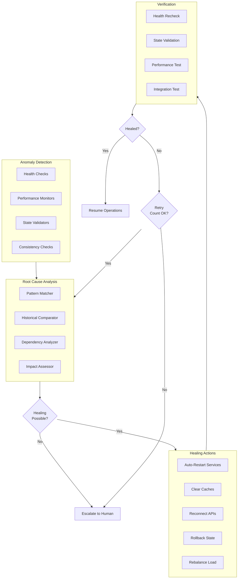

### 6.2 Healing Procedures State Machine

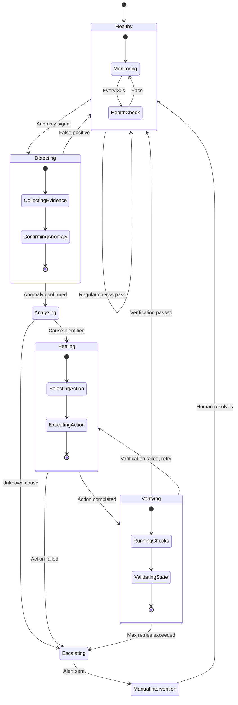

### 6.3 Healing Actions Matrix

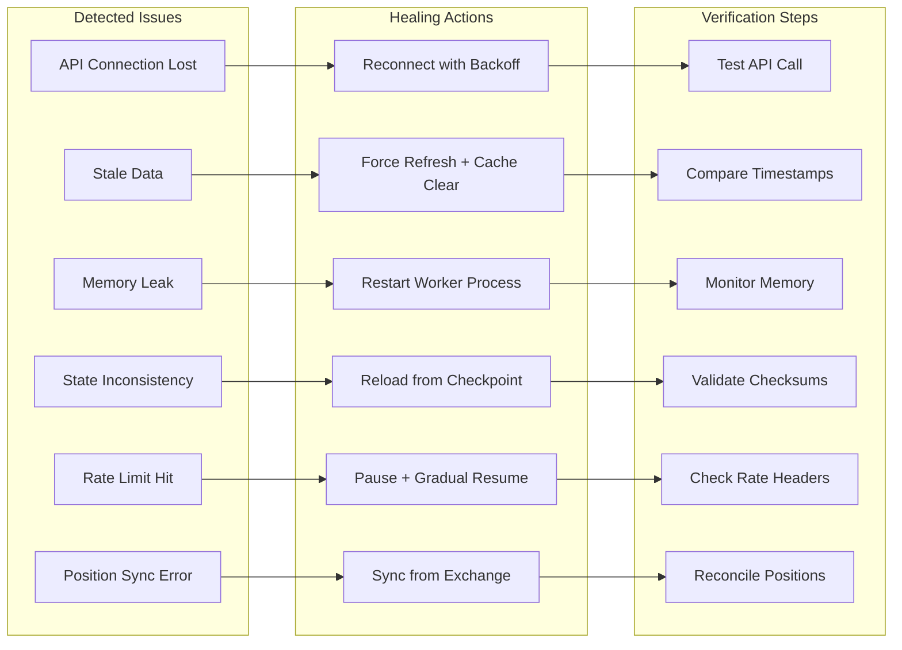

### 6.4 Self-Healing Configuration

```python
SELF_HEALING_CONFIG = {
    "health_checks": {
        "interval_seconds": 30,
        "timeout_seconds": 10,
        "consecutive_failures_threshold": 3,
        
        "checks": [
            {
                "name": "api_connectivity",
                "endpoint": "polymarket_client.get_active_markets",
                "expected": "non_empty_list",
                "healing_action": "reconnect_api",
            },
            {
                "name": "data_freshness",
                "check": "last_data_update < 5_minutes",
                "healing_action": "force_refresh",
            },
            {
                "name": "position_sync",
                "check": "local_positions == remote_positions",
                "healing_action": "sync_positions",
            },
            {
                "name": "memory_usage",
                "threshold": "memory_pct < 80",
                "healing_action": "restart_worker",
            },
            {
                "name": "state_consistency",
                "check": "validate_state_checksums",
                "healing_action": "rollback_checkpoint",
            },
        ],
    },
    
    "healing_actions": {
        "reconnect_api": {
            "max_attempts": 5,
            "backoff_base": 2,
            "max_backoff": 300,
            "cooldown_after_success": 60,
        },
        "force_refresh": {
            "clear_cache": True,
            "reset_rate_limits": True,
            "max_attempts": 3,
        },
        "sync_positions": {
            "source_of_truth": "exchange",
            "reconcile_discrepancies": True,
            "alert_on_mismatch": True,
        },
        "restart_worker": {
            "graceful_shutdown": True,
            "save_state_first": True,
            "restart_delay": 5,
        },
        "rollback_checkpoint": {
            "max_rollback_age_hours": 24,
            "verify_after_rollback": True,
            "alert_on_rollback": True,
        },
    },
    
    "escalation": {
        "max_healing_attempts": 3,
        "escalation_channels": ["telegram", "email"],
        "require_human_ack": True,
        "auto_resume_after_hours": 4,
    }
}
```

---

## 7. State Machine Specifications

### 7.1 Main Bot State Machine

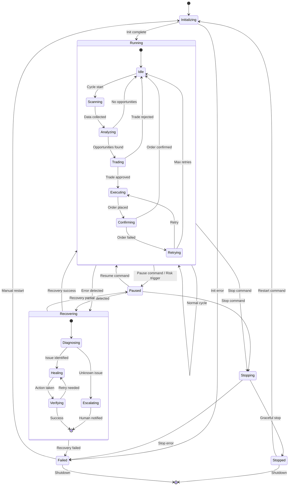

### 7.2 Trading Cycle State Machine

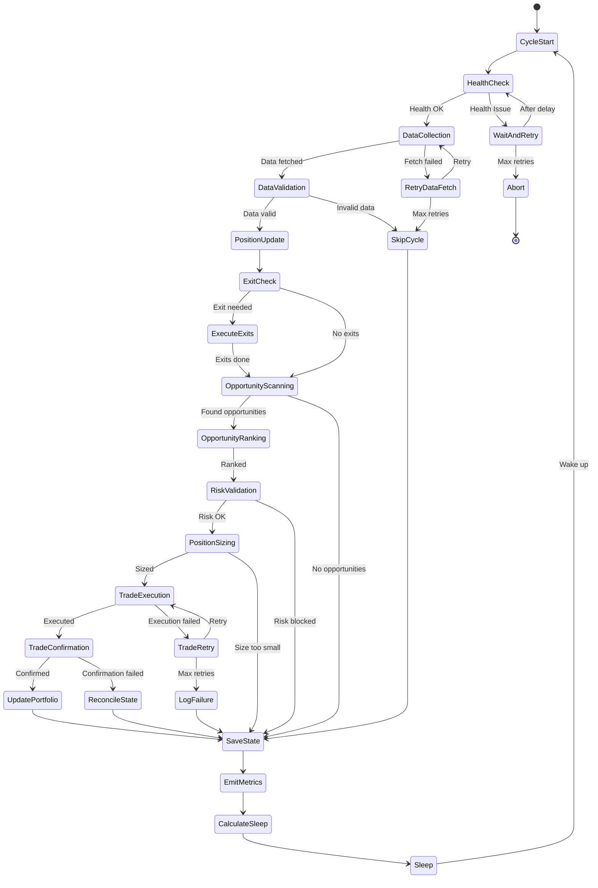

### 7.3 Position Lifecycle State Machine

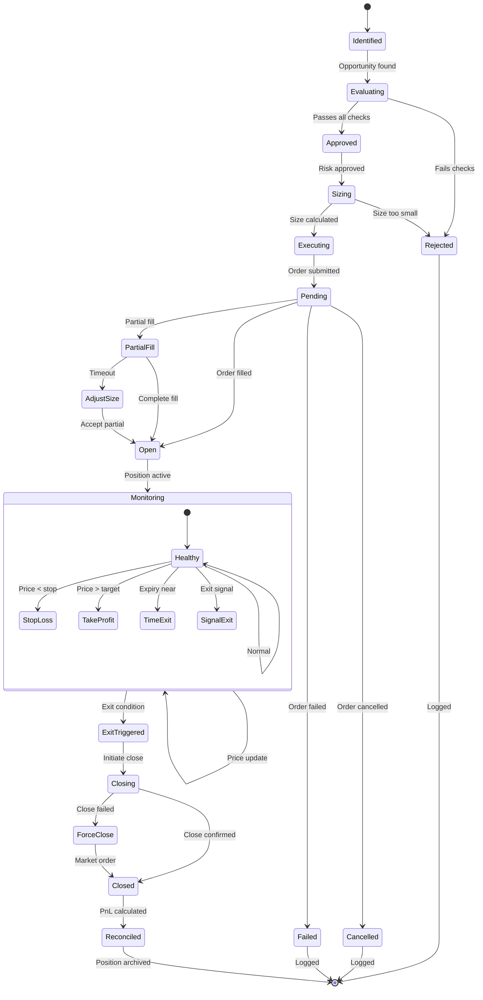

---

## 8. Decision Trees

### 8.1 Trade Entry Decision Tree

```
TRADE ENTRY DECISION TREE
=========================

1. OPPORTUNITY DETECTED
   |
   +--[NO]--> END (No Trade)
   |
   +--[YES]
        |
        2. EDGE >= MIN_EDGE?
           |
           +--[NO]--> END (Insufficient Edge)
           |
           +--[YES]
                |
                3. CONFIDENCE >= MIN_CONFIDENCE?
                   |
                   +--[NO]--> END (Low Confidence)
                   |
                   +--[YES]
                        |
                        4. CAPITAL AVAILABLE?
                           |
                           +--[NO]--> END (No Capital)
                           |
                           +--[YES]
                                |
                                5. POSITION COUNT < MAX?
                                   |
                                   +--[NO]--> END (Position Limit)
                                   |
                                   +--[YES]
                                        |
                                        6. DRAWDOWN < THRESHOLD?
                                           |
                                           +--[NO]
                                           |    |
                                           |    +--[DD < 25%]--> REDUCED_SIZE
                                           |    |
                                           |    +--[DD >= 25%]--> END (Risk Pause)
                                           |
                                           +--[YES]
                                                |
                                                7. CORRELATION CHECK PASS?
                                                   |
                                                   +--[NO]--> END (Correlation Risk)
                                                   |
                                                   +--[YES]
                                                        |
                                                        8. CALCULATE KELLY SIZE
                                                           |
                                                           +--[SIZE < MIN]--> END (Too Small)
                                                           |
                                                           +--[SIZE >= MIN]
                                                                |
                                                                9. VOLATILITY ADJUSTMENT
                                                                   |
                                                                   +--[EXTREME]--> SIZE *= 0.4
                                                                   +--[HIGH]----> SIZE *= 0.7
                                                                   +--[NORMAL]--> SIZE *= 1.0
                                                                   +--[LOW]-----> SIZE *= 1.2
                                                                        |
                                                                        10. EXECUTE TRADE
                                                                            |
                                                                            --> SUCCESS / RETRY / FAIL
```

### 8.2 Trade Exit Decision Tree

```
TRADE EXIT DECISION TREE
========================

1. POSITION ACTIVE
   |
   +-- CHECK EVERY CYCLE
        |
        2. MARKET RESOLVED?
           |
           +--[YES]--> CLOSE (Resolution)
           |
           +--[NO]
                |
                3. STOP LOSS HIT? (Current PnL <= -50%)
                   |
                   +--[YES]--> CLOSE (Stop Loss)
                   |
                   +--[NO]
                        |
                        4. TAKE PROFIT HIT? (Current PnL >= +50%)
                           |
                           +--[YES]--> CLOSE (Take Profit)
                           |
                           +--[NO]
                                |
                                5. TRAILING STOP TRIGGERED?
                                   |
                                   +--[YES]--> CLOSE (Trailing Stop)
                                   |
                                   +--[NO]
                                        |
                                        6. TIME-BASED EXIT? (Age > Max Hold)
                                           |
                                           +--[YES]--> CLOSE (Time Exit)
                                           |
                                           +--[NO]
                                                |
                                                7. SIGNAL REVERSED? (New signal opposite)
                                                   |
                                                   +--[YES]
                                                   |    |
                                                   |    +--[STRONG REVERSAL]--> CLOSE
                                                   |    |
                                                   |    +--[WEAK REVERSAL]--> REDUCE 50%
                                                   |
                                                   +--[NO]
                                                        |
                                                        8. EDGE DETERIORATED? (Edge < 2%)
                                                           |
                                                           +--[YES]--> CLOSE (Edge Gone)
                                                           |
                                                           +--[NO]
                                                                |
                                                                9. EMERGENCY EXIT? (System/Risk)
                                                                   |
                                                                   +--[YES]--> CLOSE (Emergency)
                                                                   |
                                                                   +--[NO]
                                                                        |
                                                                        --> HOLD POSITION
```

### 8.3 Error Response Decision Tree

```
ERROR RESPONSE DECISION TREE
============================

1. ERROR DETECTED
   |
   +-- CLASSIFY ERROR TYPE
        |
        2. NETWORK/TRANSIENT ERROR?
           |
           +--[YES]
           |    |
           |    3. RETRY COUNT < MAX?
           |       |
           |       +--[YES]--> WAIT (2^n seconds) --> RETRY
           |       |
           |       +--[NO]--> CIRCUIT_BREAK
           |
           +--[NO]
                |
                4. API/SERVICE ERROR?
                   |
                   +--[YES]
                   |    |
                   |    5. CIRCUIT ALREADY OPEN?
                   |       |
                   |       +--[YES]--> USE_FALLBACK
                   |       |
                   |       +--[NO]--> OPEN_CIRCUIT --> USE_FALLBACK
                   |
                   +--[NO]
                        |
                        6. DATA VALIDATION ERROR?
                           |
                           +--[YES]
                           |    |
                           |    7. CRITICAL DATA?
                           |       |
                           |       +--[YES]--> SKIP_CYCLE + ALERT
                           |       |
                           |       +--[NO]--> USE_CACHED + LOG
                           |
                           +--[NO]
                                |
                                8. EXECUTION ERROR?
                                   |
                                   +--[YES]
                                   |    |
                                   |    9. ORDER SUBMITTED?
                                   |       |
                                   |       +--[YES]--> VERIFY_STATE + RECONCILE
                                   |       |
                                   |       +--[NO]--> LOG + CONTINUE
                                   |
                                   +--[NO]
                                        |
                                        10. RISK/LIMIT BREACH?
                                            |
                                            +--[YES]
                                            |    |
                                            |    11. CRITICAL BREACH?
                                            |        |
                                            |        +--[YES]--> EMERGENCY_EXIT + HALT
                                            |        |
                                            |        +--[NO]--> PAUSE_TRADING + ALERT
                                            |
                                            +--[NO]
                                                 |
                                                 12. UNKNOWN ERROR
                                                     |
                                                     --> LOG_FULL_CONTEXT
                                                     --> ALERT_OPERATOR
                                                     --> SAFE_STATE
```

### 8.4 Self-Healing Decision Tree

```
SELF-HEALING DECISION TREE
==========================

1. HEALTH CHECK TRIGGERED
   |
   +-- RUN ALL HEALTH CHECKS
        |
        2. ALL CHECKS PASS?
           |
           +--[YES]--> CONTINUE (Healthy)
           |
           +--[NO]
                |
                3. IDENTIFY FAILING CHECK
                   |
                   +--[API_CONNECTIVITY]
                   |    |
                   |    --> ACTION: Reconnect with backoff
                   |    --> VERIFY: Test API call
                   |
                   +--[DATA_FRESHNESS]
                   |    |
                   |    --> ACTION: Force refresh + clear cache
                   |    --> VERIFY: Check data timestamps
                   |
                   +--[POSITION_SYNC]
                   |    |
                   |    --> ACTION: Sync from exchange
                   |    --> VERIFY: Reconcile positions
                   |
                   +--[MEMORY_USAGE]
                   |    |
                   |    --> ACTION: Restart worker process
                   |    --> VERIFY: Monitor memory after restart
                   |
                   +--[STATE_CONSISTENCY]
                        |
                        --> ACTION: Rollback to checkpoint
                        --> VERIFY: Validate checksums
                        |
                        4. HEALING ACTION TAKEN
                           |
                           5. VERIFICATION PASS?
                              |
                              +--[YES]--> RESUME_NORMAL
                              |
                              +--[NO]
                                   |
                                   6. RETRY COUNT < MAX?
                                      |
                                      +--[YES]--> RETRY_HEALING
                                      |
                                      +--[NO]
                                           |
                                           7. ESCALATE TO HUMAN
                                              |
                                              --> SEND_ALERTS
                                              --> ENTER_SAFE_MODE
                                              --> WAIT_INTERVENTION
```

---

## 9. Implementation Roadmap

### Phase 1: Core Infrastructure (Week 1-2)

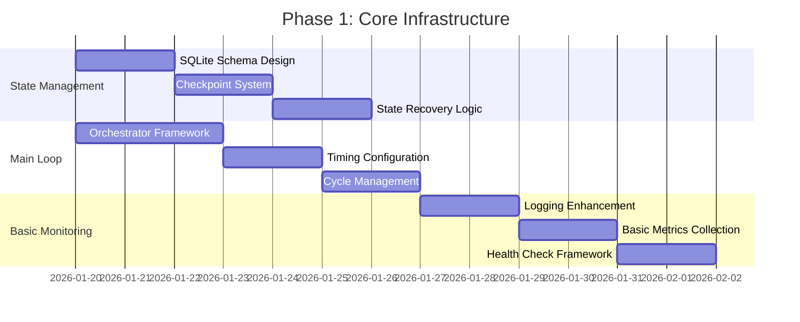

### Phase 2: Resilience Layer (Week 3-4)

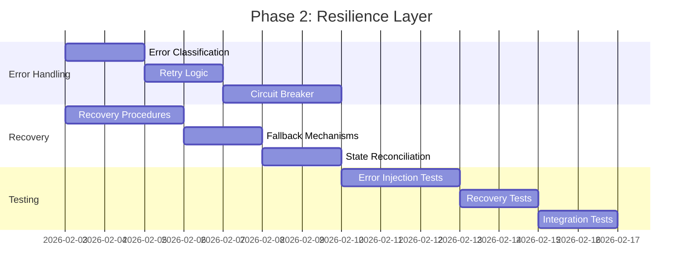

### Phase 3: Risk Management (Week 5-6)

```mermaid
gantt
    title Phase 3: Risk Management
    dateFormat YYYY-MM-DD
    
    section Risk Engine
    Risk State Machine         :a1, 2026-02-17, 3d
    Multi-Layer Checks        :a2, after a1, 3d
    Dynamic Adjustments       :a3, after a2, 2d
    
    section Position Control
    Position Limits           :b1, 2026-02-17, 2d
    Correlation Tracking      :b2, after b1, 3d
    Exit Automation           :b3, after b2, 2d
    
    section Emergency Protocols
    Emergency Exit Logic       :c1, 2026-02-24, 2d
    Safe State Entry          :c2, after c1, 2d
    Recovery Procedures       :c3, after c2, 2d
```

### Phase 4: Monitoring & Alerting (Week 7-8)

```mermaid
gantt
    title Phase 4: Monitoring & Alerting
    dateFormat YYYY-MM-DD
    
    section Metrics
    Metrics Framework          :a1, 2026-03-02, 3d
    Custom Metrics            :a2, after a1, 2d
    Aggregation Logic         :a3, after a2, 2d
    
    section Alerting
    Alert Rules Engine         :b1, 2026-03-02, 3d
    Telegram Integration      :b2, after b1, 2d
    Email Alerts              :b3, after b2, 2d
    
    section Dashboard
    Real-time Dashboard        :c1, 2026-03-09, 3d
    Historical Views          :c2, after c1, 2d
    Mobile Notifications      :c3, after c2, 2d
```

### Phase 5: Self-Healing (Week 9-10)

```mermaid
gantt
    title Phase 5: Self-Healing
    dateFormat YYYY-MM-DD
    
    section Detection
    Anomaly Detection          :a1, 2026-03-16, 3d
    Pattern Recognition       :a2, after a1, 2d
    Root Cause Analysis       :a3, after a2, 2d
    
    section Healing
    Healing Actions           :b1, 2026-03-16, 3d
    Verification Logic        :b2, after b1, 3d
    Escalation Paths          :b3, after b2, 2d
    
    section Integration
    Full System Integration    :c1, 2026-03-23, 3d
    Load Testing              :c2, after c1, 2d
    Production Deployment     :c3, after c2, 2d
```

---

## Appendix A: Configuration Templates

### Complete Bot Configuration

```python
BOT_CONFIG = {
    # Core Settings
    "bot_name": "PolymarketBot",
    "version": "2.0.0",
    "environment": "production",
    
    # Timing
    "timing": TIMING_CONFIG,
    
    # Risk Management
    "risk": RISK_MANAGEMENT_CONFIG,
    
    # Error Recovery
    "error_recovery": ERROR_RECOVERY_CONFIG,
    
    # Alerting
    "alerts": ALERT_RULES,
    
    # Self-Healing
    "self_healing": SELF_HEALING_CONFIG,
    
    # State Management
    "state": {
        "database_path": "./data/polymarket_bot.db",
        "checkpoint_interval_seconds": 300,
        "max_checkpoints": 24,
        "state_encryption": True,
    },
    
    # API Configuration
    "apis": {
        "polymarket": {
            "gamma_host": "https://gamma-api.polymarket.com",
            "clob_host": "https://clob.polymarket.com",
            "rate_limit_per_minute": 60,
            "timeout_seconds": 30,
        },
        "news_sources": [
            "https://news.google.com/rss",
            "https://feeds.bbci.co.uk/news/rss.xml",
        ],
    },
}
```

---

## Appendix B: Mermaid Diagram Index

| Diagram | Section | Purpose |
|---------|---------|---------|
| System Overview | 1 | High-level architecture |
| Primary Trading Cycle | 2.1 | Main loop flow |
| Timing Gantt | 2.2 | Cycle timing breakdown |
| Error Classification | 3.1 | Error type hierarchy |
| Circuit Breaker States | 3.2 | Circuit breaker FSM |
| Recovery Workflow | 3.3 | Error recovery flow |
| Risk Architecture | 4.1 | Multi-layer risk system |
| Risk Decision Tree | 4.2 | Risk check flow |
| Portfolio Risk States | 4.3 | Risk state machine |
| Monitoring Architecture | 5.1 | Monitoring system |
| Alert Severity | 5.2 | Alert classification |
| Dashboard Metrics | 5.3 | Key metrics layout |
| Self-Healing Architecture | 6.1 | Healing system |
| Healing States | 6.2 | Healing FSM |
| Healing Matrix | 6.3 | Issue-action mapping |
| Main Bot States | 7.1 | Bot state machine |
| Trading Cycle States | 7.2 | Cycle FSM |
| Position Lifecycle | 7.3 | Position FSM |

---

*Document Version: 1.0*
*Last Updated: January 17, 2026*
*Author: AI Workflow Designer*
